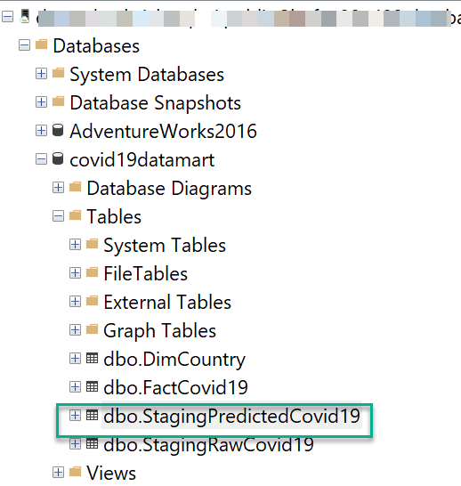

## Solution Part 1


1. The solution extracts the COVID-19 public dataset available in a data lake (Azure Storage – Blob / ADLS Gen2) into Azure Databricks as a dataframe.
2. The extracted COVID-19 dataset is cleaned, pre-processed, trained and scored using a Gradient Boosted Trees (GBT) Machine Learning model.
> GBT is chosen to predict the deaths on a given day in a given country
> purely for demonstration purposes only and should not be considered as
> the only model for such prediction.
3. The resulting dataset with the predicted scores is stored into a staging table in Azure SQL Managed Instance for further downstream transformation.

Notebook 1: [Notebook1 - DatabricksML-SQLMI-V1](DatabricksNotebooks/Notebook1%20-%20DatabricksML-SQLMI-V1.ipynb)

This notebook executes steps 1-3 as described in the solution architecture above. It loads the dataset from the publicly available _[pandemicdatalake](https://azure.microsoft.com/en-au/services/open-datasets/catalog/ecdc-covid-19-cases/)_ in Azure Storage.

The dataset is read into a dataframe as shown below:
```python
dfRaw = spark.read.parquet(wasbs_path)
display(dfRaw)
```
In preparing this dataframe as input featureset to the machine learning model, some cleanup is performed to drop columns that are not relevant for the model and to assemble all the relevant columns into a featureset. Also, equally important for the model’s input featureset is to index string and categorical columns using a String and Vector Indexer to flag that these are categorical values as opposed to continuous values.
```python
stringindexer = StringIndexer(inputCol="countries_and_territories", outputCol="countries_index")
dfTransformed = stringindexer.fit(dfClean).transform(dfClean)
```
Note that the *model’s outcome is to predict the number of deaths* (fatalities) based on a partial dataset the model is trained with. Hence, the column ‘deaths’ needs to be dropped from the featureset.
```python
featuresCols = dfTransformed.columns
featuresCols.remove('deaths')
featuresCols.remove('countries_and_territories')
vectorAssembler = VectorAssembler(inputCols=featuresCols, outputCol="assembledFeatures", handleInvalid="skip")
#maxCategories value is set to 210 to consider the countries column as a category (there are roughly 210 countries in the dataset)
vectorIndexer = VectorIndexer(inputCol="assembledFeatures", outputCol="finalFeatures", maxCategories=210)
```
The dataframe is split into a training (70%) and a test (30%) dataset following which a GBT Regression model is then applied to make the prediction. To achieve a reasonable level of accuracy, the model is also tuned using a cross validator which tests a grid of hyperparameters and chooses the best set from it.
```python
gbt = GBTRegressor(featuresCol="finalFeatures", labelCol="deaths", maxIter=10)
paramGrid = ParamGridBuilder()\
  .addGrid(gbt.maxDepth, [10, 15])\
  .addGrid(gbt.maxBins, [210, 250])\
  .build()
# Using the Mean Absolute Error as an evaluation metric
evaluator = RegressionEvaluator(metricName="mae", labelCol=gbt.getLabelCol(), predictionCol=gbt.getPredictionCol())
# tune the model using cross validator
cv = CrossValidator(estimator=gbt, evaluator=evaluator, estimatorParamMaps=paramGrid)
```
The penultimate step in the machine learning workflow is to tie all the steps above in pipeline to process features, apply the evaluation metric, cross validate the hyperparameters and train the model by calling `fit()`.
```python
pipeline = Pipeline(stages=[vectorAssembler, vectorIndexer, cv])
pipelineModel = pipeline.fit(train)
```
The final step is to make predictions on the test dataset by calling `transform()`. This demo applies the prediction to the entire dataset to allow us to visualize the predictions against the actuals in downstream applications and reports.
```python
predictions = pipelineModel.transform(dfTransformed)
```
The predicted dataset (stored in a dataframe) is then written to a staging table `dbo.StagingPredictedCovid19` in SQL MI.<BR>

This notebook uses the [Spark Connector for SQL Server and Azure SQL](https://cloudblogs.microsoft.com/sqlserver/2020/06/22/apache-spark-connector-for-sql-server-and-azure-sql-is-now-open-source/)  is based on the Spark DataSourceV1 API and SQL Server Bulk API and  uses the same interface as the built-in JDBC Spark-SQL connector.

> While the Microsoft SQL Server JDBC driver library (mssql-jdbc) is pre-installed in [Databricks Runtime 3.4](https://docs.microsoft.com/en-us/azure/databricks/release-notes/runtime/3.4#pre-installed-java-and-scala-libraries-scala-210-cluster-version) and above, the new Spark connector for SQL needs to be exclusively installed using the .JAR file as shown in the pre-requisites section of this solution.

*Compared to the built-in JDBC connector, the Apache Spark Connector for SQL Server and Azure SQL is up to 15X faster than the default connector for data writes. The connector takes advantage of Spark’s distributed architecture to move data in parallel, efficiently using all cluster resources.*
```python
sqlmiconnection = dbutils.secrets.get(scope = "sqlmi-kv-secrets", key = "sqlmiconn")
sqlmiuser = dbutils.secrets.get(scope = "sqlmi-kv-secrets", key = "sqlmiuser")
sqlmipwd = dbutils.secrets.get(scope = "sqlmi-kv-secrets", key = "sqlmipwd")
dbname = "Covid19datamart"
servername = "jdbc:sqlserver://" + sqlmiconnection
database_name = dbname
url = servername + ";" + "database_name=" + dbname + ";"
table_name = "[Covid19datamart].[dbo].[StagingPredictedCovid19]"

try:
  dfPredicted.write \
        .format("com.microsoft.sqlserver.jdbc.spark") \
        .option("url", url) \
        .option("dbtable", table_name) \
        .option("user", sqlmiuser) \
        .option("port", 3342) \
        .option("password", sqlmipwd) \
        .option("applicationintent", "ReadWrite") \
        .mode("append") \
        .save()
except ValueError as error :
    print("Connector write failed", error)
```

)

> It is recommended to store SQL MI credentials as secrets either in [Databricks scoped secrets or in Azure Key Vault](https://docs.microsoft.com/en-us/azure/databricks/security/secrets/secret-scopes) to enable sharing the notebooks with multiple users without exposing the credentials displayed. Secrets retrieved in the notebook are always redacted when displayed assuring the SQL MI credentials are
> never exposed to users.

The records can be verified by querying the table `dbo.StagingPredictedCovid19` in SQL MI.
)

In the next part of the solution, data from this staging table is read back into Databricks along with the dimension table `dbo.DimCountry`, joined together and transformed to create a denormalized dataset to be written into the fact table `dbo.FactCovid19`.

[**Proceed to Part 2 -->**](Part2_README.md)

[**<-- Go back to main page**](README.md)
