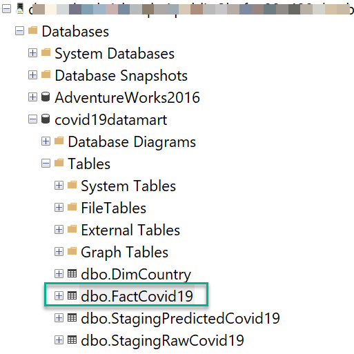
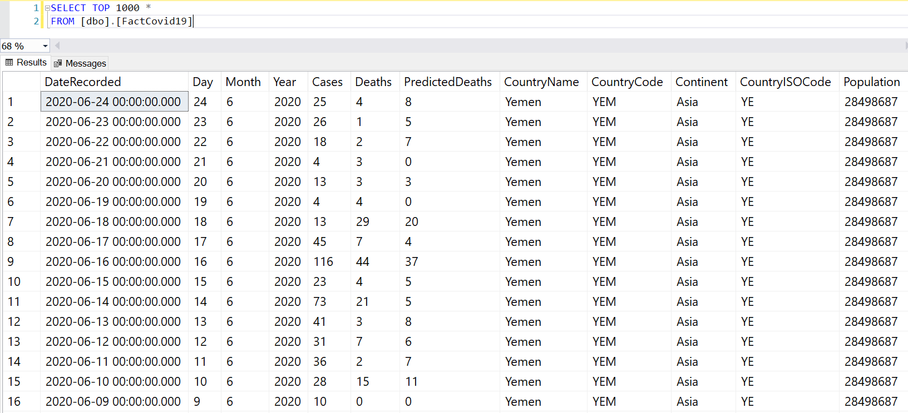
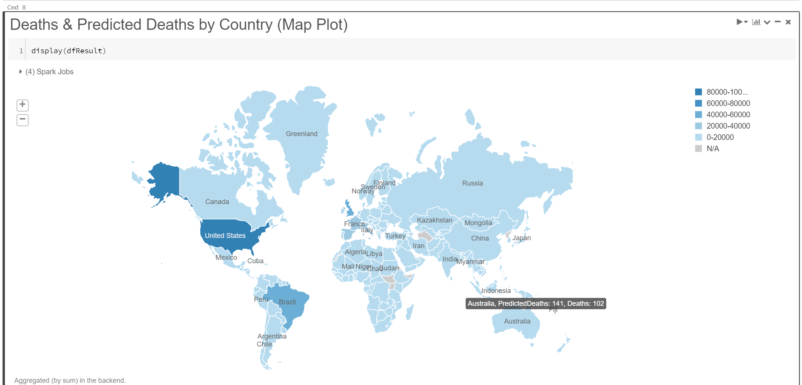

## Solution Part 2


4. Common data dimension tables and the staging table (in Step 3) from Azure SQL Managed Instance are read into dataframes in Azure Databricks.
> The two Managed Instances shown in the “Store” and the “Serve” layer are essentially the same instance just depicted in different phases of the data flow. In a real-world, Azure SQL Managed Instance or Azure SQL Databases can play the role of both a data storage service and data serving service for consuming applications / data visualization tools.
5. The dataframes containing the necessary dimension and staging data are further refined, joined and transformed to produce a denormalized fact table for reporting.
6. The resulting denormalized data table is written to Azure SQL Managed Instance ready to serve the data consumers.

Notebook 2: [Notebook2 - Read-Write-SQLMI-V1](DatabricksNotebooks/Notebook2%20-%20Read-Write-SQLMI-V1.ipynb)

The objective of this Python notebook is to demonstrate the usage of Spark connector for SQL Server to read and write data from Azure SQL Managed Instance while leveraging Spark in Azure Databricks to perform data transformation (Steps 4-6 in the architecture diagram above).

In this solution, Azure SQL Managed Instance [Business Critical tier](https://docs.microsoft.com/en-us/azure/azure-sql/managed-instance/sql-managed-instance-paas-overview#business-critical-service-tier) is used which provides a readable secondary by default. The solution works just as good with the [General Purpose tier](https://docs.microsoft.com/en-us/azure/azure-sql/managed-instance/sql-managed-instance-paas-overview#general-purpose-service-tier) except that there is not readable secondary. Public endpoint for the SQL MI is [securely enabled](https://docs.microsoft.com/en-us/azure/azure-sql/managed-instance/public-endpoint-overview) to allow Azure Databricks to connect to the instance. If there are security restrictions in your organization that prevents the usage of public endpoint, the solution will require [Azure Databricks to be injected into a Vet](https://docs.microsoft.com/en-us/azure/databricks/administration-guide/cloud-configurations/azure/vnet-inject) and use one of the [connectivity architectures](https://docs.microsoft.com/en-us/azure/azure-sql/managed-instance/connect-application-instance?view=sql-server-2017) either using [VNet Peering](https://docs.microsoft.com/en-us/azure/virtual-network/virtual-network-peering-overview) or [VNet-to-VNet VPN Gateway](https://docs.microsoft.com/en-us/azure/vpn-gateway/vpn-gateway-howto-vnet-vnet-resource-manager-portal) to establish connectivity between Azure Databricks and SQL MI.

The following modules are required to read and write data from Azure SQL Managed Instance and hence imported at the start of the notebook.

**Retrieve credentials for SQL MI connection:**
Similar to Part 1 of the solution, the connection details and credentials stored as Azure Key Vault scoped secrets are retrieved in the notebook. Note the secrets will always be `[REDACTED]` in the notebook and will never be visible in plain text.
```python
sqlmiconnection = dbutils.secrets.get(scope = "sqlmi-kv-secrets", key = "sqlmiconn")
sqlmiuser = dbutils.secrets.get(scope = "sqlmi-kv-secrets", key = "sqlmiuser")
sqlmipwd = dbutils.secrets.get(scope = "sqlmi-kv-secrets", key = "sqlmipwd")
```
**Read tables from SQL MI:**
In order to take advantage of the readable secondary available in Business Critical tier, data can be read from the secondary by specifying the `ApplicationIntent` property of the connection as shown below. Note that `Port 3342` is specified to connect using SQL MI’s public endpoint.
```python
dbname = "Covid19datamart"
servername = "jdbc:sqlserver://" + sqlmiconnection
database_name = dbname
url = servername + ";" + "database_name=" + dbname + ";"
table_name = "[Covid19datamart].[dbo].[DimCountry]"

try:
  dfCountry = spark.read \
        .format("com.microsoft.sqlserver.jdbc.spark") \
        .option("url", url) \
        .option("dbtable", table_name) \
        .option("applicationintent", "ReadOnly") \
        .option("port", 3342) \
        .option("user", sqlmiuser) \
        .option("password", sqlmipwd).load()
except ValueError as error :
    print("Connector read failed", error)
```
**Data Transformation:**
Data from the tables `dbo.DimCountry` and `dbo.StagingPredictCovid19` is read into dataframes and joined together to produce a denormalized dataset that is recommended for data visualization and reporting tools.
```python
dfJoinedPredict = dfStagingPredict.join(dfCountry, dfStagingPredict.CountryName == dfCountry.CountryName,how='left').drop(dfCountry.CountryName)
```
The joined dataframe is then finalized by dropping unimportant columns, renaming columns and concatenating date part columns to produce a `datetime` column before writing the dataset to SQL MI.
```python
dfResult = dfJoinedPredict.withColumn("DateRecorded", to_date(concat_ws("-",dfJoinedPredict.Year,dfJoinedPredict.Month,dfJoinedPredict.Day)).cast('timestamp')) \
  .withColumnRenamed("Prediction","PredictedDeaths") \
  .drop("CountryMLIndex") \
  .drop("LoadDate") \
  .drop("DimCountryPK") \
  .drop("GeoID")
```
**Write results to SQL MI:**
The finalized dataset is written to the fact table `dbo.FactCovid19` in SQL MI using the `append` mode. Note that the mode can be changed to `overwrite` based on your requirement.
```python
try:
  dfResult.write \
        .format("com.microsoft.sqlserver.jdbc.spark") \
        .option("url", url) \
        .option("dbtable", table_name) \
        .option("user", sqlmiuser) \
        .option("port", 3342) \
        .option("password", sqlmipwd) \
        .option("applicationintent", "ReadWrite") \
        .mode("append") \
        .save()
except ValueError as error :
    print("Connector Write failed", error)
```
The records are now available in dbo.FactCovid19 in SQL MI



The fact data can be visualized by reporting or data visualization tools like [Power BI](https://powerbi.microsoft.com/en-us/), consumed by APIs in downstream applications or even visualized in the same Databricks notebook as shown below.

**Data visualization:**


[**<-- Go back to Part 1**](Part1_README.md)

[**<-- Go to main page -->**](README.md)
