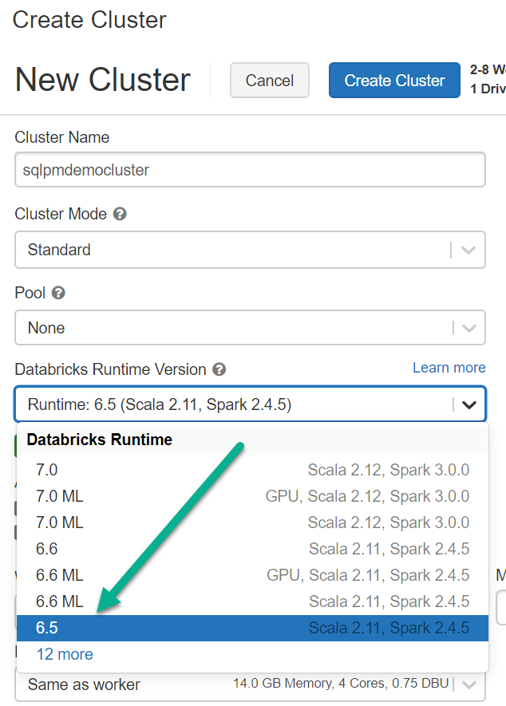
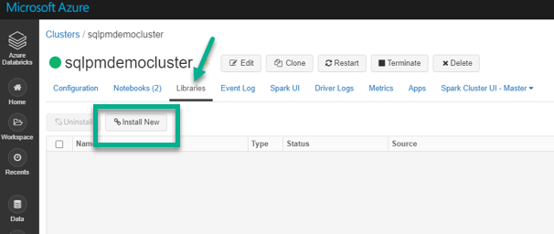
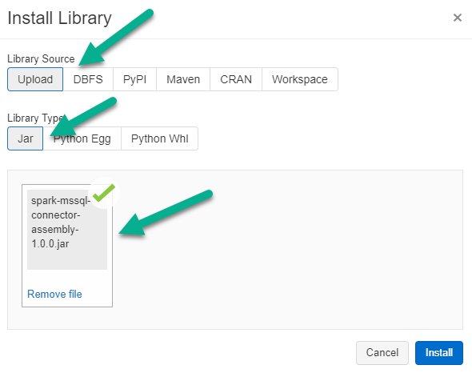

The objective of this solution is to demonstrate the integration between Azure Databricks and Azure SQL Managed Instance to deliver insights and data visualizations using a publicly available [COVID-19 dataset](https://azure.microsoft.com/en-au/services/open-datasets/catalog/ecdc-covid-19-cases/). While Azure Databricks provides the distributed computing power to process and transform complex datasets, Azure SQL Managed Instance acts as a recipient of the batch scored predictions and transformed data to serve it to business users. In doing so, the solution uses a publicly available COVID-19 dataset and runs a machine learning model in Databricks to predict the fatalities which are then written into a datamart in Azure SQL Managed Instance for visualization and reporting.

> Note: Gradient Boosting Trees (GBT) Regression model has been used in
> the solution purely for demonstration purposes and by no means should
> this be considered as the only machine learning algorithm to run
> predictions on the dataset used.


**Apache Spark Connector for SQL Server and Azure SQL**

The [Spark connector for SQL Server and Azure SQL](https://docs.microsoft.com/en-us/azure/azure-sql/database/spark-connector) enables databases in Azure SQL Database, Azure SQL Managed Instance, and SQL Server to act as the input data source or output data sink for Spark jobs. The Spark connector is a high-performance connector that enables you to use  transactional data in big data analytics and persists results for ad-hoc queries or reporting.

Key features of this connector include:
-   Support for all Spark bindings (Scala, Python, R).
-   Basic authentication and Active Directory (AD) keytab support.
-   Reordered DataFrame write support.
-   Reliable connector support for single instance.

The connector can either be downloaded from [this GitHub repo](https://github.com/microsoft/sql-spark-connector/releases/tag/v1.0).

**Solution Architecture**

The solution architecture below depicts the various phases of data flow along with a variety of data sources and data consumers involved. In this diagram, Azure SQL Database or Azure SQL Managed Instance can be interchangeably used as a storage / serving layer for datamart.

The solution comprises of the following parts as described in the data flow below (the sequence numbers are highlighted in the architecture diagram above)

 1. The solution extracts the COVID-19 public dataset available in a
    data lake (Azure Storage – Blob / ADLS Gen2) into Azure Databricks
    as a dataframe.
  2. The extracted COVID-19 dataset is cleaned, pre-processed, trained
    and scored using a Gradient Boosted Trees (GBT) Machine Learning
    model.

> *GBT is chosen to predict the deaths on a given day in a given country
> purely for   demonstration purposes only and should not
>     be considered as the only model for such prediction.*

3. The resulting dataset with the predicted scores is stored into a
staging table in Azure SQL Managed Instance for further downstream
transformation.
4. Common data dimension tables and the staging table (in Step 3) from
Azure SQL Managed Instance are read into dataframes in Azure
Databricks.

> The two Managed Instances shown in the “Store” and the “Serve” layer
> are essentially the same instance just depicted in different phases of
> the data flow. In a real-world, Azure SQL Managed Instance or Azure
> SQL Databases can play the role of both a data storage service and
> data serving service for consuming applications / data visualization
> tools.

5. The dataframes containing the necessary dimension and staging data
are further refined, joined and transformed to produce a
denormalised fact table for reporting.
6. The resulting denormalised data table is written to Azure SQL
Managed Instance ready to serve the data consumers.

**Azure Services:**
The solution requires the following Azure Services and their relevant SKUs.
1. **Azure Databricks Standard / Premium Workspace**
*Cluster Options: Databricks Runtime Version 6.5; Standard Mode; 2 Worker nodes and 1 Driver Node;
Node specification: Standard_DS3_v2*
2. **Azure SQL Managed Instance Business Critical 4vCores** (General Purpose can also be used). Business Critical is used for demonstration as it comes with a built-in Read Only replica that can be used for data reads / reporting.
3. **Azure Key Vault (Standard)** – to save secrets such as SQL Managed Instance login password

The solution is divided into two parts in two Azure Databricks notebooks. Click on the links below to dive deeper into each part of the solution. <br>
[**Part 1 walkthrough**](Part1_README.md): 
[Notebook1 - DatabricksML-SQLMI-V1](DatabricksNotebooks/Notebook1%20-%20DatabricksML-SQLMI-V1.ipynb) emphasizes on the machine learning model training and batch scoring that executes Steps 1-3 in the data flow described above.

[**Part 2 walkthrough**](Part2_README.md):
[Notebook2 - Read-Write-SQLMI-V1](DatabricksNotebooks/Notebook2%20-%20Read-Write-SQLMI-V1.ipynb) emphasizes on reading and writing data to Azure SQL Managed Instance using the Spark AzureSQL Connector that executes steps 4-6 in the data flow above.

## **Pre-requisites: {IMPORTANT}**

**1. Select Databricks Runtime with Scala 2.11 or higher:**  
When creating the Databricks cluster, it is important to select the Databricks Runtime  with Scala version 2.11 (or higher) which is compatible with the Spark connector for SQL Server and Azure SQL.


**2. Install Spark Connector for Azure SQL Database:**<br>Install the [Spark connector for SQL Server library](https://github.com/microsoft/sql-spark-connector/releases/tag/v1.0) (`azure-sqldb-spark`) on the Databricks cluster by manually downloading and uploading the [apache-spark-sql-connector.jar](https://github.com/microsoft/sql-spark-connector/releases/download/v1.0/apache-spark-sql-connector.jar)<BR>



**3. Prepare SQL MI Datamart:**<br>A sample BACPAC file `Covid19datamart.bacpac` is provided [here](SQLMI/bacpac) to import and create the datamart in SQL MI. Any existing data in Staging or Fact table needs to be deleted as the solution will insert a new dataset from the data lake. After importing the file from the GitHub repo to create the datamart in Azure SQL Managed Instance, run the following stored procedure on the imported datamart:
```sql
EXEC sp_cleanuptables ‘all’
```
